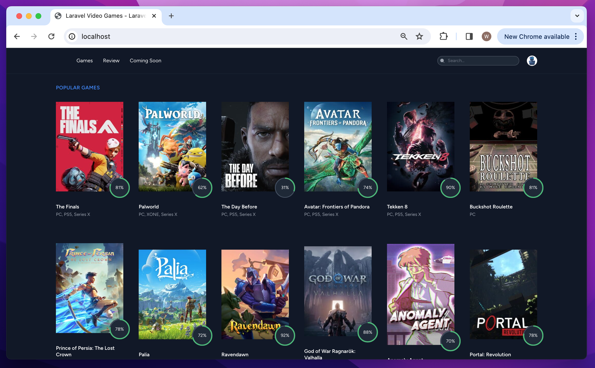

# Video Catalog App

A Video Game Aggregator application to illustrate using Laravel to pull data from the IGDB API and display game information, coming soon, 
videos, and screenshots. 

Exploring frontend features:
1. HTTP client
2. Tailwind CSS
3. Livewire
4. Alpine.js

---



Backend Framework:
- **Laravel v10.40.0 (PHP v8.3.1):** https://laravel.com/docs/10.x/installation#docker-installation-using-sail
  with Breeze, Inertia, React, and PHP Unit testing scaffolding

Frontend Framework:
- **React v8.2.0:** https://react.dev/
- Node v20.11.0
- Npm v10.3.0

Frontend installed packages:
- coming soon....

Note:
- Docker/Sail is installed

## Local Dev Installation

Clone the repo locally:

```sh
git clone https://github.com/wayjay4/video_game_aggregator_app.git video_game_aggregator_app
```

Go into video_game_aggregator_app dir:

```sh
cd video_game_aggregator_app
```

Install PHP dependencies (composer v2.6.6):

```sh
composer install
```

Install NPM dependencies (node v20.11.0, npm v10.3.0):

**Node**
```sh
nvm install 20.11.0
```
```sh
nvm use 20.11.0
```
- https://stackoverflow.com/questions/7718313/how-to-change-to-an-older-version-of-node-js

**Npm**
```sh
npm install npm@10.3.0 -g
```
- https://stackoverflow.com/questions/9755841/how-can-i-change-the-version-of-npm-using-nvm

Build assets:

```sh
npm install
```

```sh
npm run dev
```

Two options to serve the Application
- 1.) using php artisan serve and local database (see instructions below)
- 2.) using docker service container (see instructions below)

---

### 1.) Serve application with php artisan and local database

Setup configuration:

```sh
cp .env.example .env
```

Generate application key:

```sh
php artisan key:generate
```

Create a local MySql database. You can also use another database (SQLite, Postgres), simply update your configuration accordingly.

- open .env file and change db settings as needed
- make database as needed

Run database migrations and seeder:

```sh
php artisan migrate:fresh --seed
```

Run the dev server (the output will give the address):

```sh
php artisan serve
```

You're ready to go! Visit App in your browser!

---

### 2.) Serve application with Docker/Sail

Setup configuration:

```sh
cp .env.docker .env
```

Generate application key:

```sh
php artisan key:generate
```

Install Docker

Make sure you have installed and started Docker Desktop Application:
- https://www.docker.com/

Start Docker/Sail:

```sh
./vendor/bin/sail up
```

Configuring A Shell Alias for 'sail' (optional)

- https://laravel.com/docs/10.x/sail#configuring-a-shell-alias


```sh
sail up
```

Run database migrations and seeder for db service container:

```sh
sail artisan migrate:fresh --seed
```

You're ready to go! Visit App in your browser!:

http://localhost/
